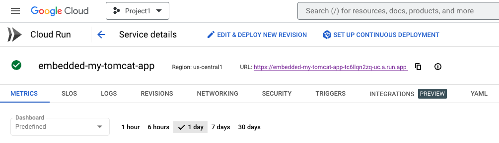
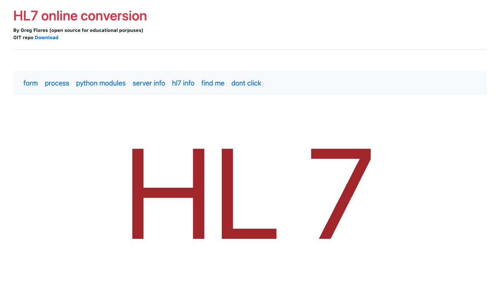
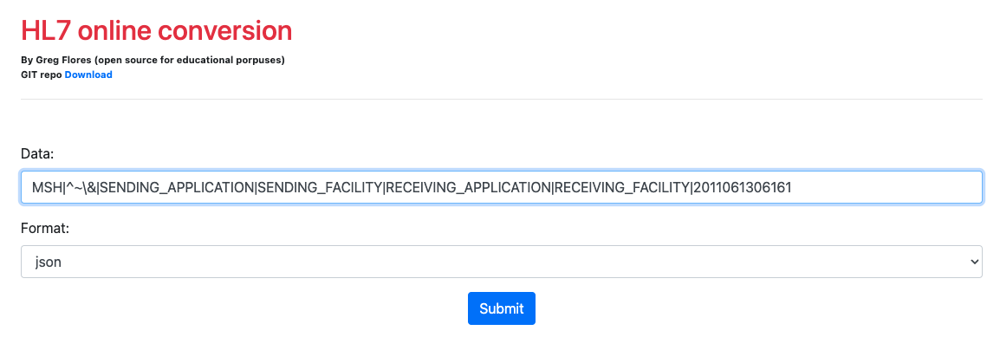
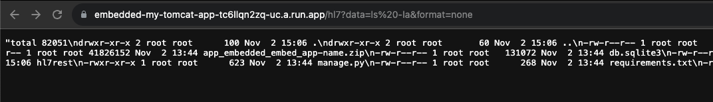
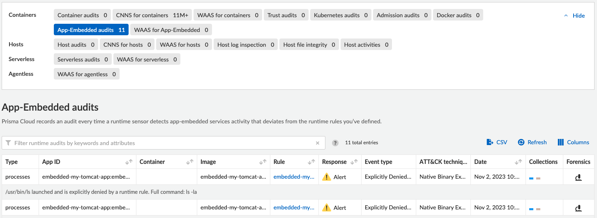
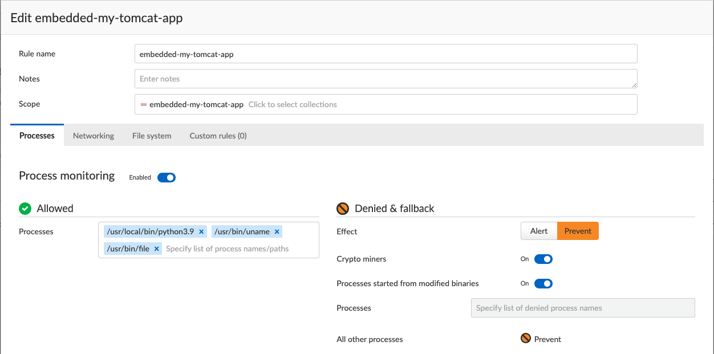
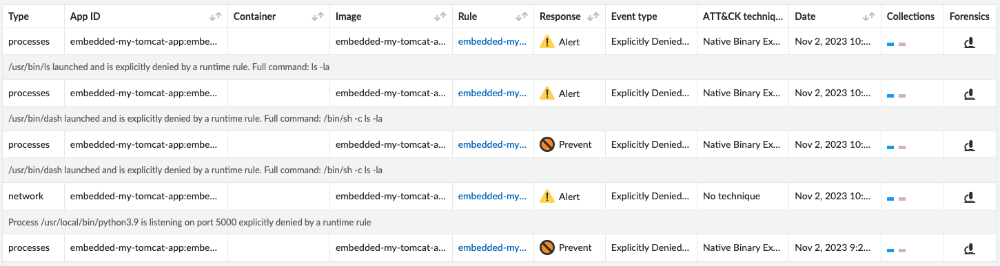
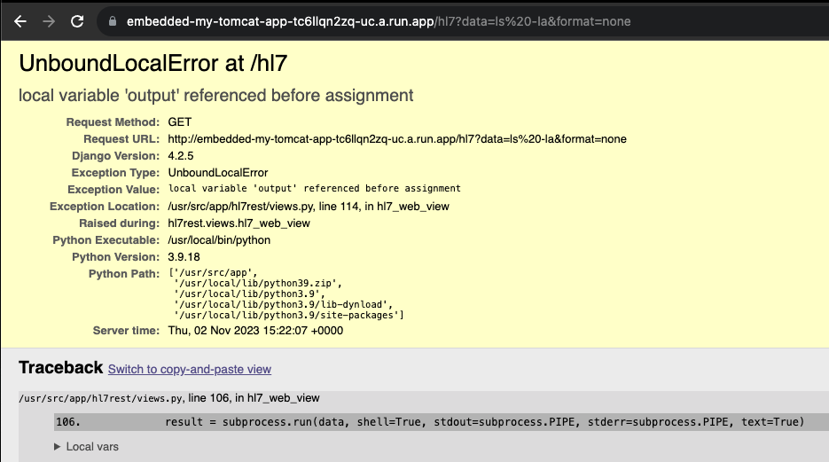

# Prisma Cloud Workload Protection 

[Workload protection](https://www.prismacloud.io/)

## App-embedded Defender with Google Cloud Run

In this repository, build, push and deploy an application that is protected with an app-embedded defender.  We have also included automation for deploying the associated Compute collection and Compute runtime policy. 

[Google Cloud Run](https://cloud.google.com/run) is our Google service of choice for this deployment. 

The automation tool of choice is [Github Actions](https://github.com/actions)


## Requirements for Deployment
3 Secrets are needed for this project, and they should be configured in the **Actions secrets and variables** section of the repo

  - Prisma Cloud Compute API URL - PCC_API
    - Similar to: https://us-west1.cloud.twistlock.com/us-4-xxxxxxxx
  - Prisma Cloud Access Key - PCC_KEY
  - Prisma Cloud Secret Key - PCC_SEC

Google Cloud Platform also provides keyless authentication and some of my notes are documented, but I followed the steps [here](https://github.com/google-github-actions/auth#setup) 

[Here is a link to my notes](authentication.md) - TODO (More to be flushed out here)


## Deploying the application
- Navigate to the Github actions tab in the specific repo
  - Select the "Create Application" workflow
  - Choose "Run Workflow"
- [This workflow](.github/workflows/workflow-create.yml) will automate all the necessary steps to deploy this application with security.  Once this is complete, move to the next steps of testing. 
- Navigate to the [Google Cloud Run interface](https://console.cloud.google.com/run)
  - Find this newly created application from the above workflow
  - Similar to https://{application name}-{unique identifier}-uc.a.run.app



- Paste this applications URL into a Web Browser, and you should see the following.  This is an HL7 online conversion tool. The HL7 messaging standard defines the structure and content of messages that are exchanged between systems in various administrative, financial, and clinical activities in the healthcare industry.



- At this link [HL7 Sample Messages](https://docs.webchartnow.com/functions/system-administration/interfaces/sample-hl7-messages/) you can find some sample HL7 message, and HL7 is the spec for how medical devices communicate. 
- Here is a sample from the site that can be used. 

```MSH|^~\&|SENDING_APPLICATION|SENDING_FACILITY|RECEIVING_APPLICATION|RECEIVING_FACILITY|20110613061611||SIU^S12|24916560|P|2.3||||||```

- The sample can be submitted by clicking on the *form* navigation, using the *Data* field
- Once the app is loaded, drop the above message into the Form field and choose submit.



 
- This will properly submit the form and give a result back in json form. 
- To run the attack, modify the URL to replace the form data with something that is non HL7 as seen below.  You are need to adjust the format to none.  See example below.
  - ```ls -la```
  - ```cat /etc/shadow```
  - ```whoami```

- https://{application name}-{unique identifier}-uc.a.run.app/hl7?data=ls%20-la&format=none



- As you can see in this output, we pass in the ```ls -la``` command, in Linux this will output the directory structure of the current directory. This command may be harmless, but an attacker could take advantage of this opening and run commands that are more threatening. 

- As you look in the Console under events, you will see some audit for **App-Embedded audits**




- Repeat the above steps after enabling the **prevent** effect in the app-embedded policy in Prisma Cloud Compute > Defend > Runtime > App-Embedded



- Now in the audits page, you will see the **Prevent Response** and you will also see that the HL7 application did not output the directory listing. 



